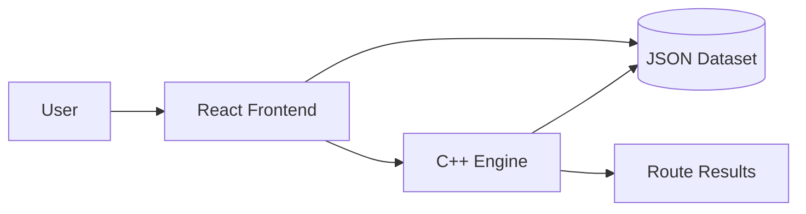
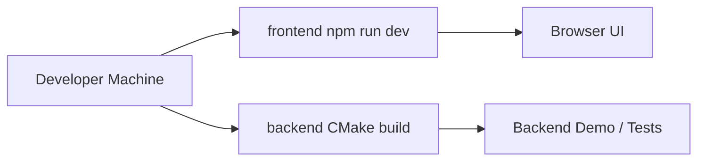

# System Architecture

```mermaid
flowchart LR
  U[User] --> R[React Frontend]
  R --> D[(JSON Dataset)]
  R --> C[C++ Engine]
  C --> D
  C --> O[Route Results]
```

## Deployment View

```mermaid
flowchart LR
  Dev[Developer Machine] --> FE[frontend npm run dev]
  Dev --> BE[backend CMake build]
  FE --> Browser[Browser UI]
  BE --> CLI[Backend Demo / Tests]
```
