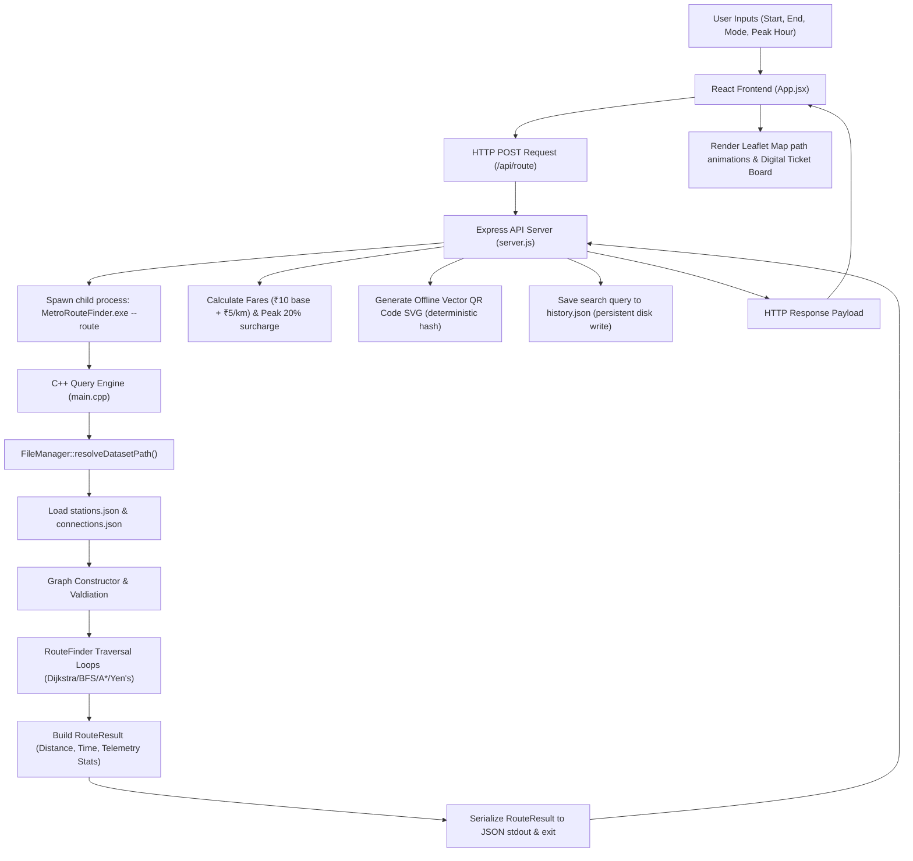
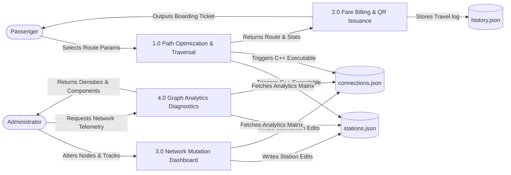
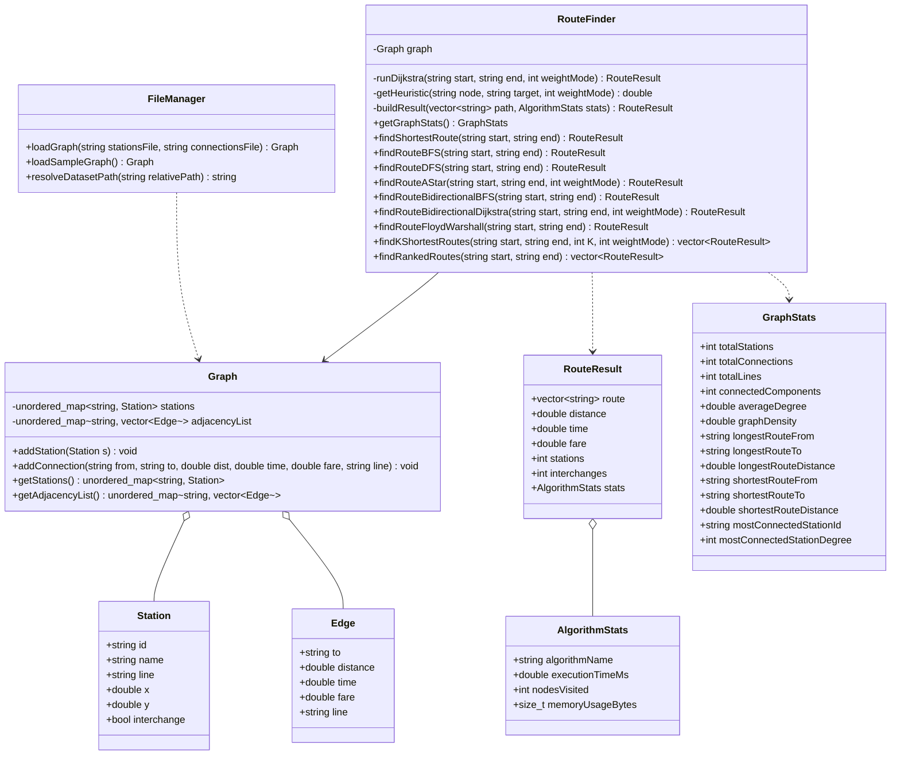
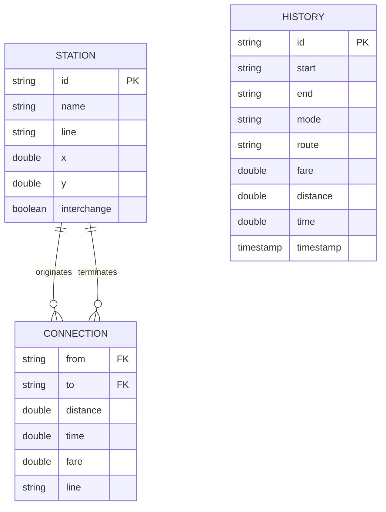

# Project Documentation & Architecture Manual

This document details the system design, algorithmic mechanics, and database schemas of the **Metro Route Finder** project. It includes flowcharts, Data Flow Diagrams (DFDs), UML Class diagrams, and Entity-Relationship (ER) schemas rendered using Mermaid.js.

---

## 1. System Flowchart (Route Calculation Flow)

---

## 2. Data Flow Diagram (DFD Level 1)

---

## 3. UML Class Diagram (C++ Backend Architecture)

---

## 4. Entity-Relationship (ER) Diagram (Database Models)

