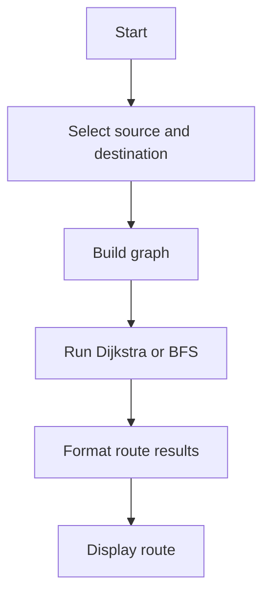
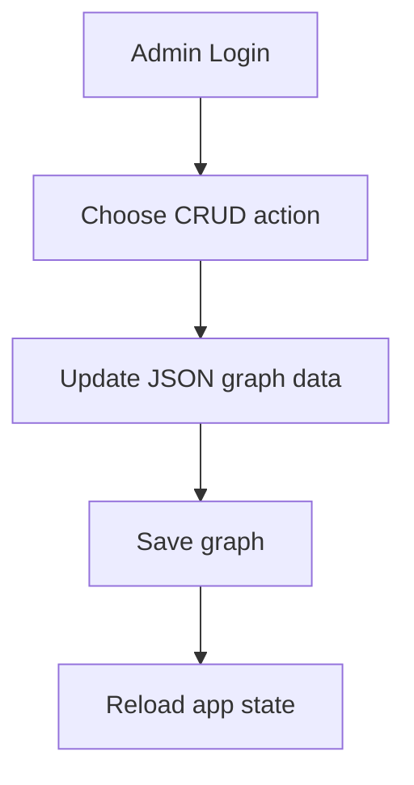

# Flowcharts

```mermaid
flowchart TD
  A[Start] --> B[Select source and destination]
  B --> C[Build graph]
  C --> D[Run Dijkstra or BFS]
  D --> E[Format route results]
  E --> F[Display route]
```

```mermaid
flowchart TD
  A1[Admin Login] --> B1[Choose CRUD action]
  B1 --> C1[Update JSON graph data]
  C1 --> D1[Save graph]
  D1 --> E1[Reload app state]
```
