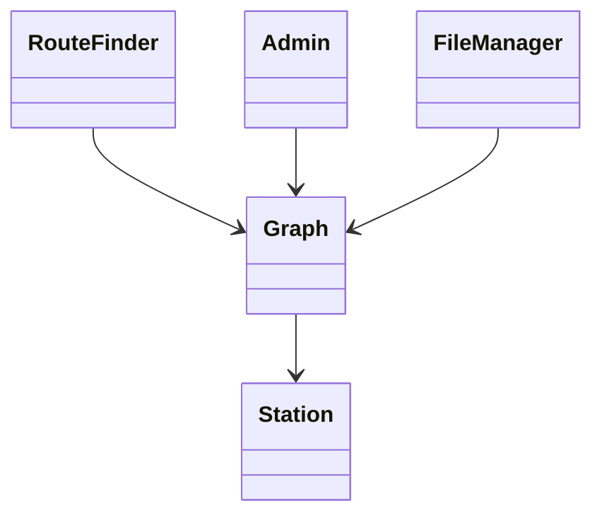
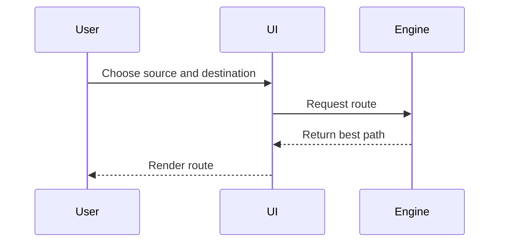
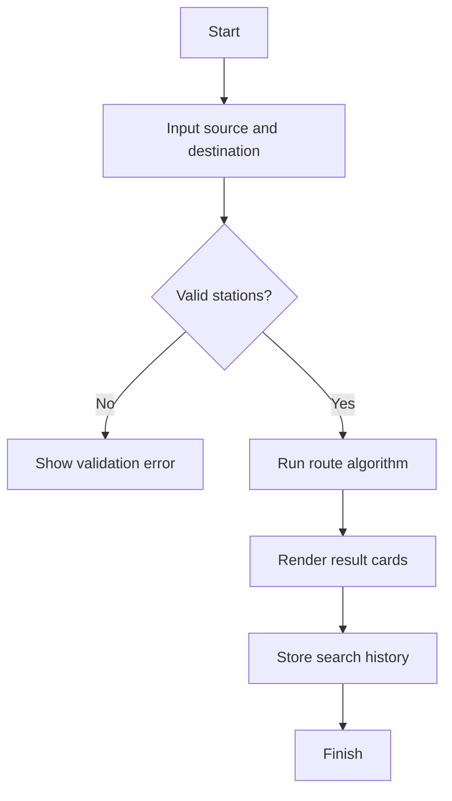

# UML Diagrams

## Class Diagram

```mermaid
classDiagram
  class Station
  class Graph
  class RouteFinder
  class FileManager
  class Admin
  Graph --> Station
  RouteFinder --> Graph
  Admin --> Graph
  FileManager --> Graph
```

## Sequence Diagram

```mermaid
sequenceDiagram
  participant User
  participant UI
  participant Engine
  User->>UI: Choose source and destination
  UI->>Engine: Request route
  Engine-->>UI: Return best path
  UI-->>User: Render route
```

## Activity Diagram

```mermaid
flowchart TD
  S[Start] --> I[Input source and destination]
  I --> V{Valid stations?}
  V -- No --> E[Show validation error]
  V -- Yes --> R[Run route algorithm]
  R --> P[Render result cards]
  P --> T[Store search history]
  T --> F[Finish]
```
