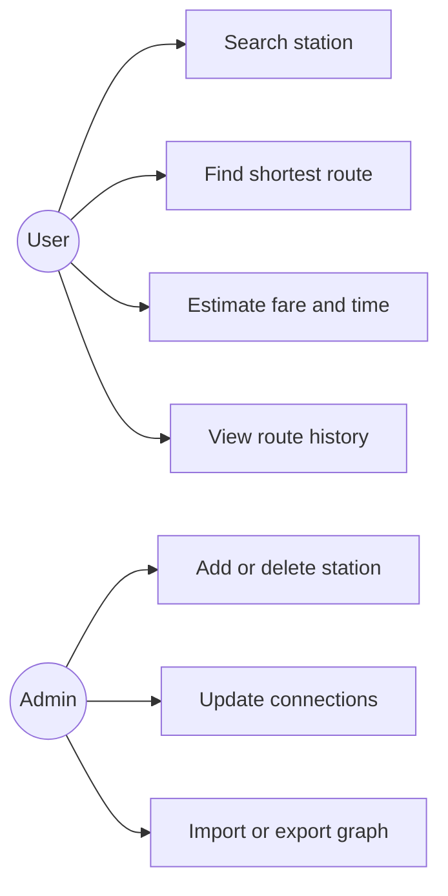

# Use Case Diagram

```mermaid
flowchart LR
  User((User)) --> UC1[Search station]
  User --> UC2[Find shortest route]
  User --> UC3[Estimate fare and time]
  User --> UC4[View route history]
  Admin((Admin)) --> UC5[Add or delete station]
  Admin --> UC6[Update connections]
  Admin --> UC7[Import or export graph]
```
